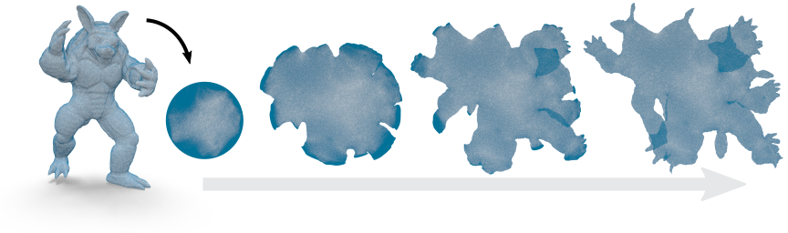
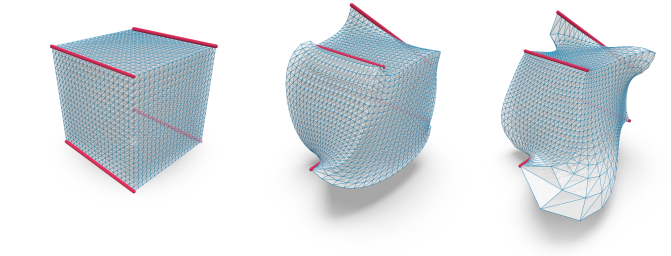
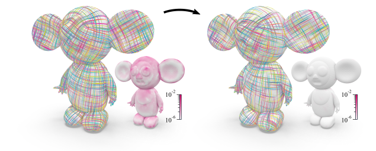
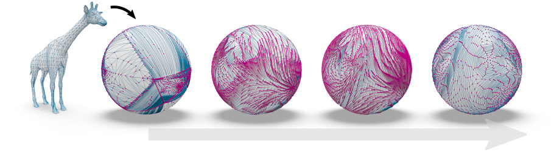
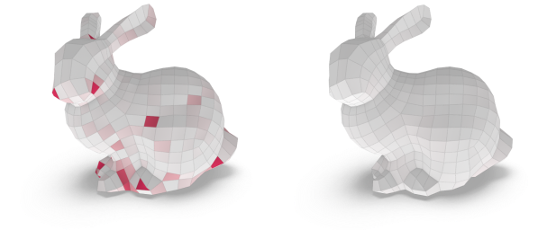

# TinyAD

TinyAD is a **C++ header-only** library for **second-order automatic differentiation**. Small dense problems are differentiated in forward mode, which allows unrestricted looping and branching. An interface for per-element functions allows convenient differentiation of large sparse problems, which are typical in geometry processing on meshes. For more details see our [paper](https://graphics.rwth-aachen.de/media/papers/341/TinyAD.pdf) or watch our [talk](https://youtu.be/FGG07HoVFEk).

# Integration
TinyAD has been tested on Linux, Mac, and Windows (VS >= 2017). It only requires:

* A C++17 compiler 
* Eigen (e.g. `sudo apt-get install libeigen3-dev`)

To use TinyAD, include either `TinyAD/Scalar.hh`, `TinyAD/ScalarFunction.hh`, or `TinyAD/VectorFunction.hh`.

# Basic Usage
We provide the scalar type `TinyAD::Double<k>` as a drop-in replacement for `double`. For small problems, simply choose the number of variables `k` and generate a vector of active variables. Then, perform computations as usual (e.g. using Eigen) and query the gradient and Hessian of any intermediate variable:
```c++
#include <TinyAD/Scalar.hh>

// Choose autodiff scalar type for 3 variables
using ADouble = TinyAD::Double<3>;

// Init a 3D vector of active variables and a 3D vector of passive variables
Eigen::Vector3<ADouble> x = ADouble::make_active({0.0, -1.0, 1.0});
Eigen::Vector3<double> y(2.0, 3.0, 5.0);

// Compute angle using Eigen functions and retrieve gradient and Hessian w.r.t. x
ADouble angle = acos(x.dot(y) / (x.norm() * y.norm()));
Eigen::Vector3d g = angle.grad;
Eigen::Matrix3d H = angle.Hess;
```
All derivative computations are inlined and thus available for compiler optimization. As no taping is needed in forward mode, any kind of run time branching is possible.

# Sparse Interface
Sparse problems on meshes can be implemented using our `ScalarFunction` or `VectorFunction` interfaces. Just pass a set of _variable handles_, a set of _element handles_, and a lambda function to be evaluated for each element. For example, in a planar parametrization problem, the variables are 2D positions per vertex, and the summands of the objective function are defined per face, each accessing 3 vertices:
```c++
#include <TinyAD/ScalarFunction.hh>

// Set up a function with 2D vertex positions as variables
auto func = TinyAD::scalar_function<2>(mesh.vertices());

// Add an objective term per triangle. Each connecting 3 vertices
func.add_elements<3>(mesh.faces(), [&] (auto& element)
{
    // Element is evaluated with either double or TinyAD::Double<6>
    using T = TINYAD_SCALAR_TYPE(element);

    // Get variable 2D vertex positions of triangle t
    OpenMesh::SmartFaceHandle t = element.handle;
    Eigen::Vector2<T> a = element.variables(t.halfedge().to());
    Eigen::Vector2<T> b = element.variables(t.halfedge().next().to());
    Eigen::Vector2<T> c = element.variables(t.halfedge().from());

    return ...
});

// Evaluate the funcion using any of these methods:
double f = func.eval(x);
auto [f, g] = func.eval_with_gradient(x);
auto [f, g, H] = func.eval_with_derivatives(x);
auto [f, g, H_proj] = func.eval_with_hessian_proj(x);
...
```

Handle types from multiple mesh data structures are supported, e.g., OpenMesh, polymesh, geometry-central, or libigl-style matrices. Support for new types can be added by overloading a single function (see [`TinyAD/Support/Common.hh`](include/TinyAD/Support/Common.hh)).

# Examples
To get started, take a look at one of our [TinyAD-Examples](https://github.com/patr-schm/TinyAD-Examples).
We implement objective functions and basic solvers for typical geometry processing tasks using various mesh libraries.

## Surface Mesh Parametrization


We compute a piecewise linear map from a disk-topology triangle mesh to the plane and optimize the symmetric Dirichlet energy via a Projected-Newton solver.
This can be the basis to experiment with more specialized algorithms or more complex objective functions.
We provide examples using different mesh representations:

[`parametrization_openmesh.cc`](https://github.com/patr-schm/TinyAD-Examples/blob/main/apps/parametrization_openmesh.cc)  
[`parametrization_polymesh.cc`](https://github.com/patr-schm/TinyAD-Examples/blob/main/apps/parametrization_polymesh.cc)  
[`parametrization_geometrycentral.cc`](https://github.com/patr-schm/TinyAD-Examples/blob/main/apps/parametrization_geometrycentral.cc)  
[`parametrization_libigl.cc`](https://github.com/patr-schm/TinyAD-Examples/blob/main/apps/parametrization_libigl.cc)

## Volume Mesh Deformation


In this example, we compute a 3D deformation of a tetrahedral mesh by optimizing different distortion energies subject to position constraints:

[`deformation.cc`](https://github.com/patr-schm/TinyAD-Examples/blob/main/apps/deformation.cc)

## Frame Field Optimization


Here, we show how to re-implement the non-linear frame field optimization algorithm presented in [Integrable PolyVector Fields [Diamanti et al. 2015]](https://igl.ethz.ch/projects/integrable/), using very little code.
Given an input frame field (two tangent vectors per triangle), the algorithm optimizes an objective based on complex polynomials via a Gauss-Newton method:

[`polycurl_reduction.cc`](https://github.com/patr-schm/TinyAD-Examples/blob/main/apps/polycurl_reduction.cc)

## Manifold Optimization


We optimize a map from a genus 0 surface to the sphere using a technique from manifold optimization. Vertex trajectories on the sphere are parametrized via tangent vectors and a retraction operator:

[`manifold_optimization.cc`](https://github.com/patr-schm/TinyAD-Examples/blob/main/apps/manifold_optimization.cc)

## Quad Mesh Planarization


In this example, we optimize the 3D vertex positions of a quad mesh for face planarity.
We implement one of the objective terms from [Geometric Modeling with Conical Meshes and Developable Surfaces [Liu 2006]](http://www.geometrie.tugraz.at/wallner/quad06.pdf):

[`quad_planarization.cc`](https://github.com/patr-schm/TinyAD-Examples/blob/main/apps/quad_planarization.cc)


# Advanced Usage and Common Pitfalls
* Internal floating point types other than `double` can be used via `TinyAD::Scalar<k, T>`.
* A gradient-only mode is availabe via `TinyAD::Scalar<k, T, false>`.
* Use `to_passive(...)` to explicitly cast an active variable back to its scalar type without derivatives. E.g. to implement assertions or branching which should not be differentiated.
* [Avoid using the `auto` keyword](https://eigen.tuxfamily.org/dox/TopicPitfalls.html#TopicPitfalls_auto_keyword) when when working with Eigen expressions. This is a limitation of Eigen and can produce unexpected results due to the deleted temporary objects.
* Use e.g. `cos(...)` instead of `std::cos(...)`.
* A common source for errors in the implementation of objective functions (per-element lambdas passed to `func.add_elements(...)`) are multiple return statements of different types. This may lead to a compiler error, but can be prevented by explicitly stating the correct return type via:  
`func.add_elements<...>(..., [&] (auto& element) -> TINYAD_SCALAR_TYPE(element) { return ... });`
* Note that calls to math functions involving TinyAD types are only legal if the derivatives exist and are finite for the given function argument. E.g. it is illegal to call `acos(x)` with `x==1.0` since the derivative of acos is unbounded at 1.0.

# Unit Tests
When contributing to TinyAD, please run (and extend) the unit tests located in [`TinyAD/tests`](https://github.com/patr-schm/TinyAD/tree/main/tests).

You can build and run the unit tests via:
```
mkdir build
cd build
cmake -DTINYAD_UNIT_TESTS=ON ..
make -j4
./TinyAD-Tests
```

Alternatively, use the [TinyAD-Examples](https://github.com/patr-schm/TinyAD-Examples) project which builds the unit tests by default.

# Authors

* [Patrick Schmidt](https://www.graphics.rwth-aachen.de/person/232/)  
* [Janis Born](https://www.graphics.rwth-aachen.de/person/97/)  
* [David Bommes](http://cgg.unibe.ch/person/1/)  
* [Marcel Campen](http://graphics.cs.uos.de/)  
* [Leif Kobbelt](https://www.graphics.rwth-aachen.de/person/3/)  

We thank all test users and contributors. In particular: Alexandra Heuschling, Anton Florey, Dörte Pieper, Joe Jakobi, Philipp Domagalski, and David Jourdan.

# Cite TinyAD
If you use TinyAD in your academic work, please cite our paper:
```
@article{schmidt2022tinyad,
  title={{TinyAD}: Automatic Differentiation in Geometry Processing Made Simple},
  author={Schmidt, Patrick and Born, Janis and Bommes, David and Campen, Marcel and Kobbelt, Leif},
  year={2022},
  journal={Computer Graphics Forum},
  volume={41},
  number={5},
}
```


# License
TinyAD is released under the MIT license.
